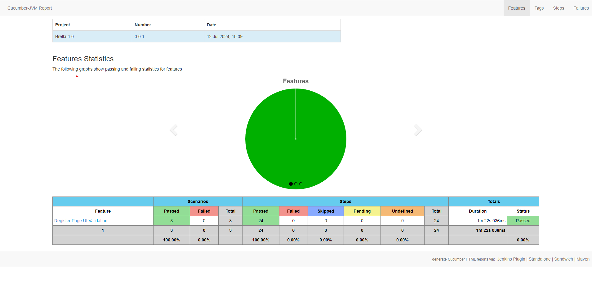

# Selenium Test Automation with Java, Cucumber, JUnit, Maven, and Cucumber Reporting

This project demonstrates how to set up and run automated tests using Selenium, Java, Cucumber, JUnit, Maven, and Cucumber Reporting.

# prerequisites
1.Java Development Kit (JDK) 8 or higher
2.Maven 3.6 or higher
3.An IDE such as IntelliJ IDEA or Eclipse
4. Required Eclipse Plugins:
    - Maven
    - Cucumber
5. Browser driver (Ensure that you have the appropriate browser driver for your desired browser and that the class path is correctly configured)

## Framework Setup

To set up the framework, you can either fork or clone the repository (https://github.com/yehen97/test-brella.git)

## Running Sample Tests

Access the CLI of your operating system (e.g., iTerm for macOS or PowerShell for Windows) and navigate to the project directory. Then, run the following command to execute the features: `mvn clean test`.
By default, this command will invoke the Chrome browser and execute the tests.

## The Page Object Design Pattern

To better organize your test code and make it more maintainable, we recommend using the Page Object Design Pattern. With this pattern, the UI elements of your web application are modeled as objects within the test code. This approach reduces code duplication and allows easy updates if the UI changes. Writing and maintaining test automation can be challenging, especially when it comes to keeping selectors (classes, IDs, or XPath, etc.) up to date with the latest code changes. The Page Object pattern provides a solution by centralizing these selectors in separate <pagename>.java files, where you can manage them along with the associated methods.

By using the Page Object pattern, your test files will only call the test methods, while the selectors and reusable methods reside in the corresponding Page Objects. This approach helps maintain a separation of concerns and ensures that when a test fails, it fails on an individual step. If a selector becomes invalid, updating it in the Page Object file can fix multiple failing tests that rely on the same selector.

Implementing the Page Object pattern promotes maintainable and scalable test automation code, making it easier to adapt to UI changes and keep your code DRY (Don't Repeat Yourself).

## Reporters

Once you have run your tests, you can generate various types of reports. This `selenium-cucumber-java` framework utilizes different test reporters to communicate pass/failure information.

## Reporting

### Cucumber Report

